# 🚗 Paylaşımlı Yolculuk Platformu (Ridesharing SuperApp)

> **Proje Özeti ve Teknik Dokümantasyon**
> *Son Güncelleme: 05 Şubat 2026*

Bu doküman, projenin başlangıcından itibaren alınan teknik kararları, uygulanan mimariyi, geliştirilen özellikleri ve proje yol haritasını en ince detayına kadar açıklamaktadır.

---

## 🎯 Vizyon ve Amaç

Bu proje, Türkiye genelinde parçalı ve güvensiz olan ulaşım/taşımacılık çözümlerini tek bir "SuperApp" çatısı altında toplamayı hedefler. Sadece insan taşımacılığı değil, dört ana dikeyde hizmet verir:

1.  **👥 İnsan Taşımacılığı:** Şehirlerarası ve şehir içi paylaşımlı yolculuk (BlaBlaCar modeli).
2.  **🐕 Hayvan Taşımacılığı:** Evcil hayvanların güvenli ve konforlu transferi (Pet Taksi).
3.  **📦 Yük/Eşya Taşımacılığı:** Kargo ve parça eşya taşımacılığı (Nakliye).
4.  **🍔 Gıda Taşımacılığı:** Özel gıda ve yemek teslimatı (Kurye/Lojistik).

Amaç; güvenli, doğrulanmış ve şeffaf bir platform oluşturarak sürücülerle yolcuları/göndericileri buluşturmaktır.

---

## 🛠️ Teknoloji Yığını (Tech Stack)

Proje, modern, ölçeklenebilir ve performans odaklı teknolojiler üzerine inşa edilmiştir.

### 📱 Mobil Uygulama (Frontend)
*   **Framework:** **Flutter 3.x** (Dart) - Tek kod tabanı ile iOS, Android ve Web desteği.
*   **State Management:** **Riverpod** - Güvenli, test edilebilir ve reaktif durum yönetimi.
*   **Routing:** **GoRouter** - Derin bağlantı (deep link) destekli, deklaratif navigasyon. 
*   **networking:** **Dio** - Interceptor destekli güçlü HTTP istemcisi.
*   **Maps:** **flutter_map** ve **latlong2** - OpenStreetMap tabanlı, Google Maps API maliyeti olmayan harita çözümü.
*   **Depolama:** **flutter_secure_storage** - Token ve hassas verilerin şifreli saklanması.
*   **UI/UX:** **Glassmorphism Design System** - Özel olarak tasarlanmış, modern ve şeffaf arayüz bileşenleri.

### 🔧 Backend (API & Server)
*   **Framework:** **NestJS 10** (Node.js/TypeScript) - Modüler, test edilebilir ve kurumsal mimari.
*   **ORM:** **Prisma** - Tip güvenli veritabanı erişimi ve şema yönetimi.
*   **Veritabanı:** 
    *   *Dev:* **SQLite** (Hızlı prototipleme için)
    *   *Prod:* **PostgreSQL** (Planlanan)
*   **Gerçek Zamanlı İletişim:** **Socket.io** - Anlık mesajlaşma ve canlı takip için WebSocket.
*   **Güvenlik:** 
    *   **JWT (JSON Web Token):** Kimlik doğrulama.
    *   **Argon2:** Endüstri standardı güvenli şifreleme ile parola saklama.
*   **Dokümantasyon:** **Swagger / OpenAPI** - Otomatik API dokümantasyonu.

### 🚀 DevOps & Araçlar
*   **Containerization:** **Docker & Docker Compose** - Servislerin izole ve tutarlı çalışması.
*   **Versiyon Kontrol:** **Git** - Kaynak kod yönetimi.

---

## 🏛️ Mimari Kararlar ve Yapı

### 1. Clean Architecture (Temiz Mimari)
Hem Mobile hem Backend tarafında "Clean Architecture" prensipleri benimsenmiştir. Bu sayede iş mantığı, arayüzden ve dış servislerden bağımsızdır.

*   **Domain Layer:** Saf iş kuralları ve Model (Entity) tanımları. Hiçbir dış kütüphaneye bağımlı değildir.
*   **Data Layer:** API çağrıları, veritabanı işlemleri ve DTO dönüşümleri.
*   **Presentation/Application Layer:** UI ekranları (Flutter) veya Controller'lar (NestJS).

**Mobil Klasör Yapısı Örneği:**
```text
lib/features/auth/
 ├── domain/       # User modeli, AuthRepository arayüzü
 ├── data/         # AuthRepository implementasyonu, API servisi
 └── presentation/ # LoginScreen, RegisterScreen, AuthProvider
```

### 2. Riverpod ile Global State
State management için Provider veya Bloc yerine **Riverpod** seçilmiştir. 
*   **Neden?** Compile-time güvenliği, `ref.watch` ile kolay bağımlılık yönetimi ve `AsyncValue` ile yükleme/hata durumlarının UI'da kolayca ele alınması.
*   Tüm servisler (AuthService, TripService) ve ViewModel'ler Riverpod provider'ları olarak tanımlanmıştır.

### 3. OpenStreetMap Tercihi
Başlangıç maliyetlerini düşürmek ve API kotalarına takılmamak için Google Maps yerine **OpenStreetMap** tercih edilmiştir. `flutter_map` kütüphanesi ile vektör tabanlı veya tile tabanlı harita gösterimi sağlanmıştır.

### 4. WebSocket (Socket.io)
Mesajlaşma özelliği için polling (sürekli sunucuya sorma) yerine Event-Driven (Olay tabanlı) mimari seçilmiştir. WebSocket bağlantısı sayesinde mesajlar anlık olarak iletilir ve sunucu yükü azaltılır.

---

## 📅 Geliştirme Süreci ve Tamamlanan Özellikler

Proje adım adım geliştirilmiş ve aşağıdaki özellikler başarıyla entegre edilmiştir:

### ✅ 1. Kimlik Doğrulama ve Profil (Authentication)
*   **Kayıt/Giriş:** E-posta ve şifre ile güvenli giriş.
*   **JWT Entegrasyonu:** Access Token ile oturum yönetimi, güvenli depolama.
*   **Kullanıcı Rolleri:** Yolcu ve Sürücü ayrımı (tek hesapta iki rol).

### ✅ 2. Yolculuk Yönetimi (Trip Management)
*   **Yolculuk Oluşturma:** Sürücüler 4 farklı tipte ilan açabilir:
    *   *İnsan:* Koltuk sayısı, sigara/evcil hayvan izni.
    *   *Yük:* Max ağırlık, eşya tipi.
    *   *Hayvan:* Kafes durumu, türü.
    *   *Gıda:* Soğuk zincir gereksinimi.
*   **Arama ve Filtreleme:** Nereden > Nereye, Tarih ve Yolcu sayısı ile detaylı arama.

### ✅ 3. Rezervasyon ve Biniş Sistemi (Bookings)
*   **Rezervasyon:** Yolcular ilanlara rezervasyon yapabilir.
*   **Onay Mekanizması:** Sürücü rezervasyonu onaylar veya reddeder.
*   **QR Kod ile Biniş:** 
    *   Her rezervasyon için özel bir **QR Kod** üretilir.
    *   Sürücü, yolcunun telefonundaki QR kodu tarayarak binişi doğrular.
*   **PNR Kodu:** Kamera çalışmazsa, 6 haneli PNR kodu ile manuel doğrulama imkanı.

### ✅ 4. Güvenlik ve Doğrulama (Verification Center)
Platform güvenliğini sağlamak için çok katmanlı bir doğrulama sistemi kurulmuştur:
*   **Kimlik Doğrulama:** TC Kimlik Kartı ön yüzü yükleme.
*   **Ehliyet Doğrulama:** Sürücü belgesi yükleme.
*   **Araç Ruhsatı:** Araç kaydı sırasında ruhsat fotoğrafı zorunluluğu.
*   **Adli Sicil Kaydı:** Sürücülerin e-Devletten aldığı sicil kaydını yüklemesi.
*   *Durum Takibi:* Her belgenin "İnceleniyor", "Onaylandı" veya "Reddedildi" durumu mobilde takip edilebilir.

### ✅ 5. İletişim (Messaging)
*   **Chat Ekranı:** WhatsApp benzeri arayüz.
*   **Anlık İletim:** Socket.io ile mesajlar anında karşı tarafa düşer.
*   **Görsel Arayüz:** Gönderilen/Alınan mesaj balonları, zaman damgaları.

### ✅ 6. Değerlendirme Sistemi (Review System)
*   **Puanlama:** Yolculuk bittiğinde 5 üzerinden yıldızlı puanlama.
*   **Etiketler:** Dinamik etiketler (Örn: "Güvenli Sürücü", "Dakik", "Kibar").
*   **Yorum:** Detaylı metin yorumu bırakma.

---

## 🗄️ Veritabanı Şeması (Özet)

```mermaid
erDiagram
    User ||--o{ Vehicle : "sahibi"
    User ||--o{ Trip : "sürücü"
    User ||--o{ Booking : "yolcu"
    User ||--o{ Message : "gönderen/alan"
    
    Vehicle ||--o{ Trip : "kullanılan araç"
    
    Trip ||--o{ Booking : "rezervasyonlar"
    
    Booking ||--o{ Review : "değerlendirme"
    
    User {
        string id
        string email
        string password
        string identityStatus
        string licenseStatus
        string criminalRecordStatus
    }
    
    Trip {
        string id
        string type "people/cargo/pet/food"
        string origin
        string destination
        datetime departureTime
        float price
    }
```



---

## 📊 Görev Durumu (Task Status)

Detaylı görev listesi için: TASKS.md.

Aşağıdaki liste, projenin başlangıç hedeflerine göre güncel durumunu göstermektedir.

### 🟢 Tamamlananlar (Done)
- [x] **Proje Kurulumu:** Flutter & NestJS altyapısının hazırlanması.
- [x] **Auth Modülü:** Login, Register, JWT, Secure Storage.
- [x] **Harita Entegrasyonu:** OpenStreetMap, Markerlar, Rota çizimi.
- [x] **Yolculuk İşlemleri:** İlan oluşturma (4 tip), Arama, Listeleme.
- [x] **Rezervasyon Akışı:** Talep oluşturma, Sürücü onayı/reddi.
- [x] **Biniş Doğrulama:** QR Kod üretme, QR Kod tarama, PNR sistemi.
- [x] **Mesajlaşma:** Gerçek zamanlı sohbet altyapısı ve arayüzü.
- [x] **Güvenlik Modülü:**
    - [x] Kimlik Yükleme & API
    - [x] Ehliyet Yükleme & API
    - [x] Araç Ruhsat Yükleme & API
    - [x] Adli Sicil Kaydı Yükleme & API
- [x] **Değerlendirme Sistemi:** Puanlama ve Yorum yapma ekranları.

### 🟡 Devam Eden / Beklemede (In Progress / On Hold)
- [ ] **E-Devlet Entegrasyonu:** Manuel belge yükleme yerine otomatik API sorgusu (Hukuki süreçler gerektirdiği için 2. faza bırakıldı).
- [ ] **Otomatik Doğrulama (OCR):** Yüklenen belgelerin yapay zeka ile otomatik okunması.

### 🔴 Planlananlar (To Do - Gelecek Fazlar)
- [ ] **Ödeme Sistemi (iyzico):** Kredi kartı ile güvenli ödeme ve cüzdan sistemi.
- [ ] **Admin Paneli:** Yüklenen belgelerin yöneticiler tarafından onaylanması için web paneli.
- [ ] **Canlı Konum Takibi:** Yolculuk sırasında anlık konum paylaşımı.
- [ ] **Bildirimler:** Push Notification (Firebase) entegrasyonu.
- [ ] **Çoklu Dil Desteği:** İngilizce/Arapça dilleri.

---

## 🏁 Sonuç ve Sonraki Adımlar

Proje şu anda **MVP (Minimum Viable Product)** aşamasını başarıyla tamamlamıştır. Bir kullanıcının sisteme kaydolup, aracını doğrulayıp, ilan açması ve yolcuların bu ilana rezervasyon yapıp, QR kod ile güvenli bir şekilde yolculuğu tamamlaması mümkündür.

**Sıradaki Tavsiye Edilen Çalışma:**
Manuel olarak yüklenen bu belgelerin (Ehliyet, Ruhsat, Kimlik) bir yönetici tarafından onaylanabilmesi için basit bir **Admin Paneli** geliştirilmesi veya **Otomatik OCR** sisteminin entegre edilmesidir.


## Documentation

| Document | Description |
|----------|-------------|
| [API Spec](docs/api-spec.yaml) | OpenAPI 3.1 specification |
| [Architecture](docs/architecture.md) | System architecture diagrams |
| [ERD](docs/erd.md) | Database entity relationships |
| [ADRs](docs/decisions/) | Architecture Decision Records |
| [Runbooks](docs/runbooks.md) | Operational guides |
| [Agent Handoff](docs/AGENT_HANDOFF.md) | Technical context for future agents |
| [Task Status](TASKS.md) | Project task status |
| [Task Fork Pack](docs/TASK_FORKS.md) | Fork prompts and skill mapping |

---
*Developed by Antigravity AI Team*
