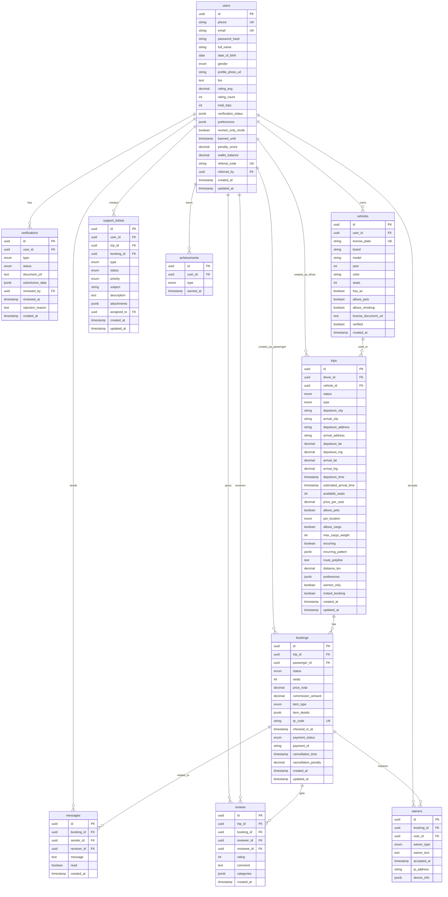

# Database Entity Relationship Diagram

## ERD Diyagramı



## Index Stratejisi

### Users Tablosu
```sql
CREATE INDEX idx_users_email ON users(email);
CREATE INDEX idx_users_phone ON users(phone);
CREATE INDEX idx_users_rating ON users(rating_avg DESC);
CREATE INDEX idx_users_referral ON users(referral_code);
```

### Trips Tablosu
```sql
CREATE INDEX idx_trips_route ON trips(departure_city, arrival_city, departure_time);
CREATE INDEX idx_trips_driver ON trips(driver_id, status);
CREATE INDEX idx_trips_status_published ON trips(status) WHERE status = 'published';
CREATE INDEX idx_trips_location_departure ON trips USING GIST(ST_MakePoint(departure_lng, departure_lat));
CREATE INDEX idx_trips_departure_time ON trips(departure_time) WHERE status = 'published';
```

### Bookings Tablosu
```sql
CREATE INDEX idx_bookings_trip ON bookings(trip_id, status);
CREATE INDEX idx_bookings_passenger ON bookings(passenger_id, status);
CREATE INDEX idx_bookings_qr ON bookings(qr_code) WHERE status IN ('confirmed', 'checked_in');
CREATE INDEX idx_bookings_payment ON bookings(payment_status);
```

### Messages Tablosu
```sql
CREATE INDEX idx_messages_booking ON messages(booking_id, created_at DESC);
CREATE INDEX idx_messages_sender ON messages(sender_id, created_at DESC);
CREATE INDEX idx_messages_receiver ON messages(receiver_id, read, created_at DESC);
```

### Reviews Tablosu
```sql
CREATE INDEX idx_reviews_reviewee ON reviews(reviewee_id, created_at DESC);
CREATE INDEX idx_reviews_trip ON reviews(trip_id);
CREATE INDEX idx_reviews_booking ON reviews(booking_id);
```

## Performans Notları

1. **Partial Indexes**: `status = 'published'` gibi filtrelerde partial index kullanıldı
2. **Composite Indexes**: Sık kullanılan query patternleri için composite index
3. **JSONB Indexes**: `preferences` ve diğer JSONB kolonları için GIN indexes
4. **Spatial Indexes**: GPS koordinatları için PostGIS GIST indexes
5. **Text Search**: Full-text search için tsvector column ve GIN index
