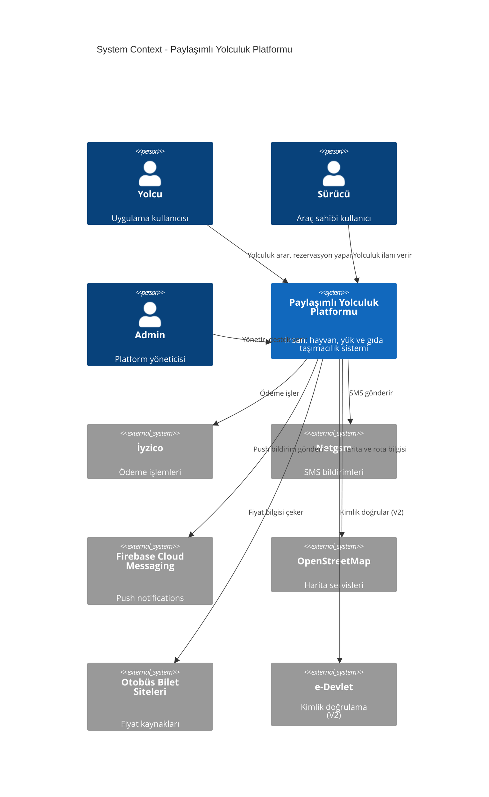
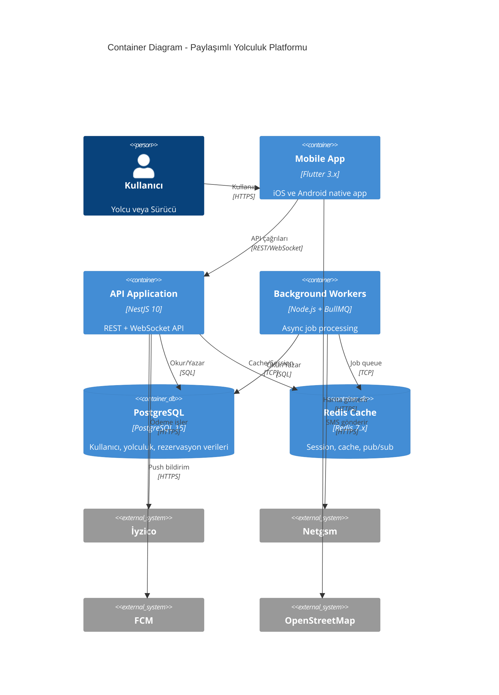
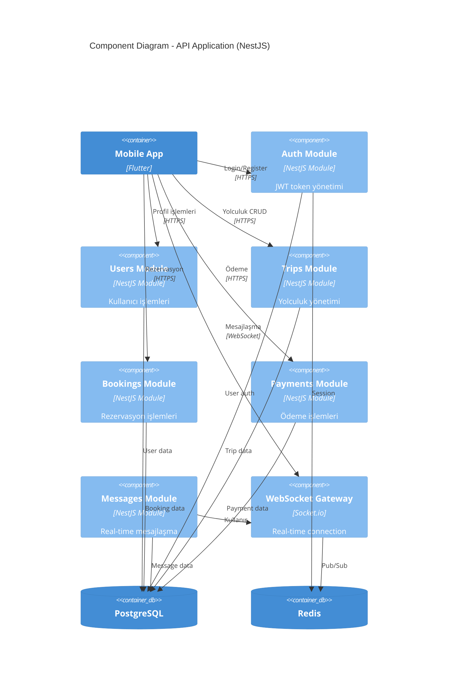
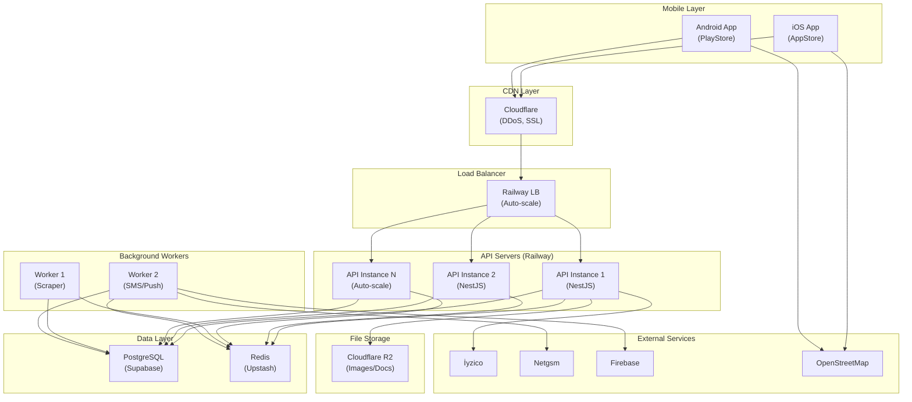
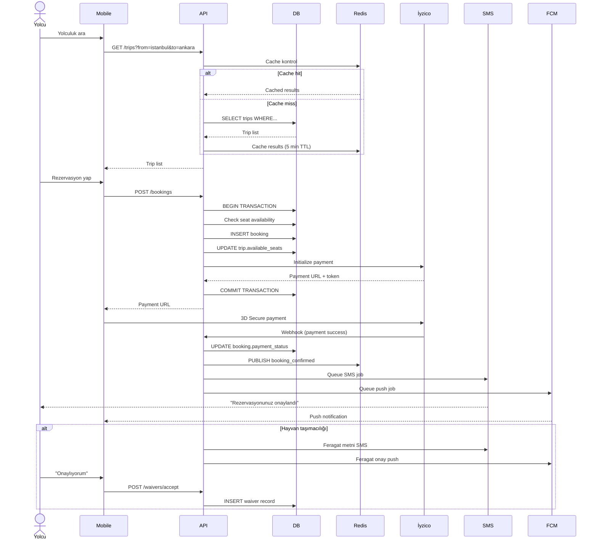
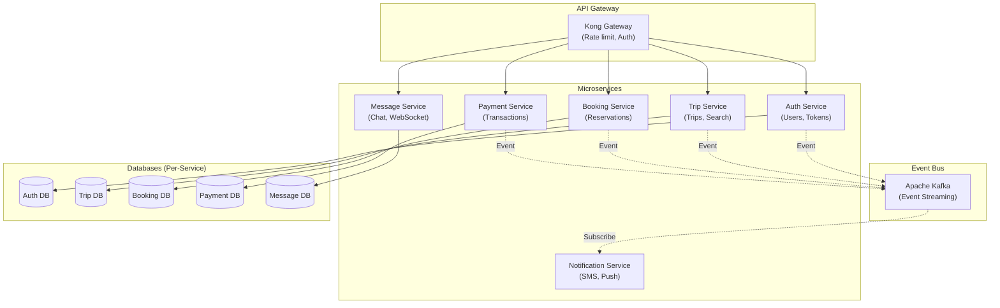

# System Architecture Diagrams

## 1. System Context Diagram (C4 Level 1)

## 2. Container Diagram (C4 Level 2)

## 3. Component Diagram - Backend API (C4 Level 3)

## 4. Deployment Diagram

## 5. Data Flow Diagram - Rezervasyon Süreci

## 6. Microservices Architecture (Future V2)

## Açıklamalar

### System Context
- Genel sistem sınırları ve dış aktörler
- Ana iletişim kanalları

### Container Diagram
- Fiziksel deployment birimleri
- Mobile app, API, Workers ayrımı
- Database ve cache katmanları

### Component Diagram
- Backend içindeki modüller
- NestJS module yapısı
- Her modülün sorumluluğu

### Deployment Diagram
- Production ortamı
- Auto-scaling stratejisi
- CDN ve load balancer
- External service bağlantıları

### Data Flow
- Rezervasyon sürecinin detaylı akışı
- Cache stratejisi
- Payment flow
- Notification sistemi

### Microservices (V2)
- Gelecek versiyonda microservice dönüşümü
- Event-driven architecture
- Database per service pattern
